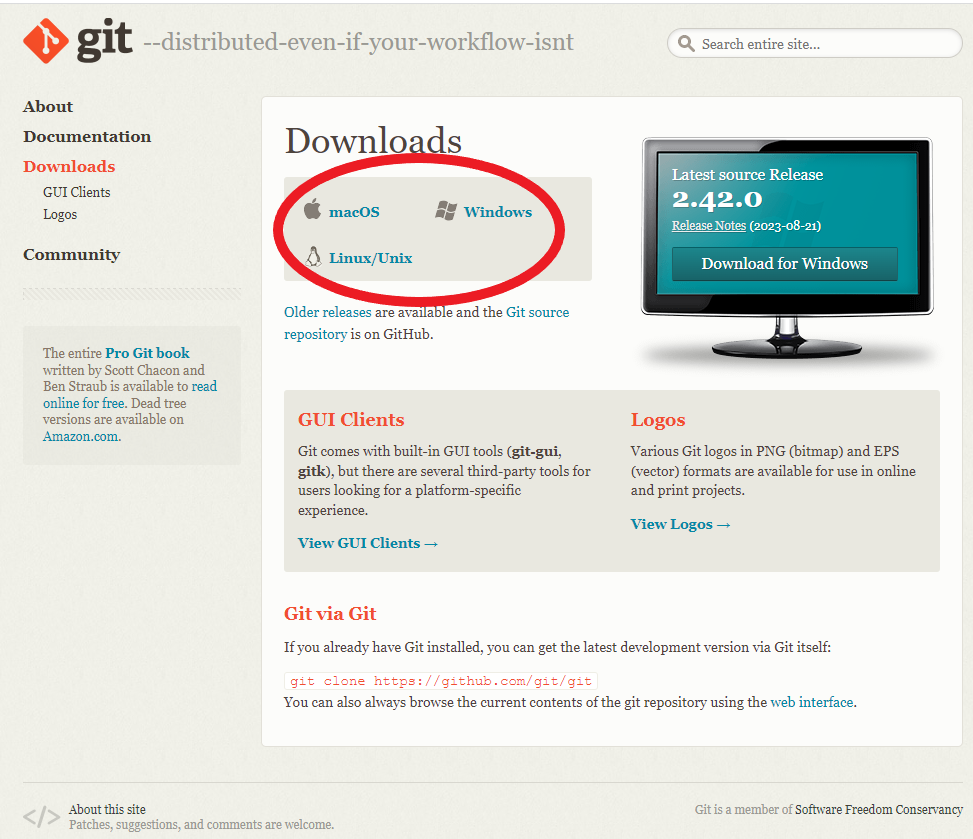
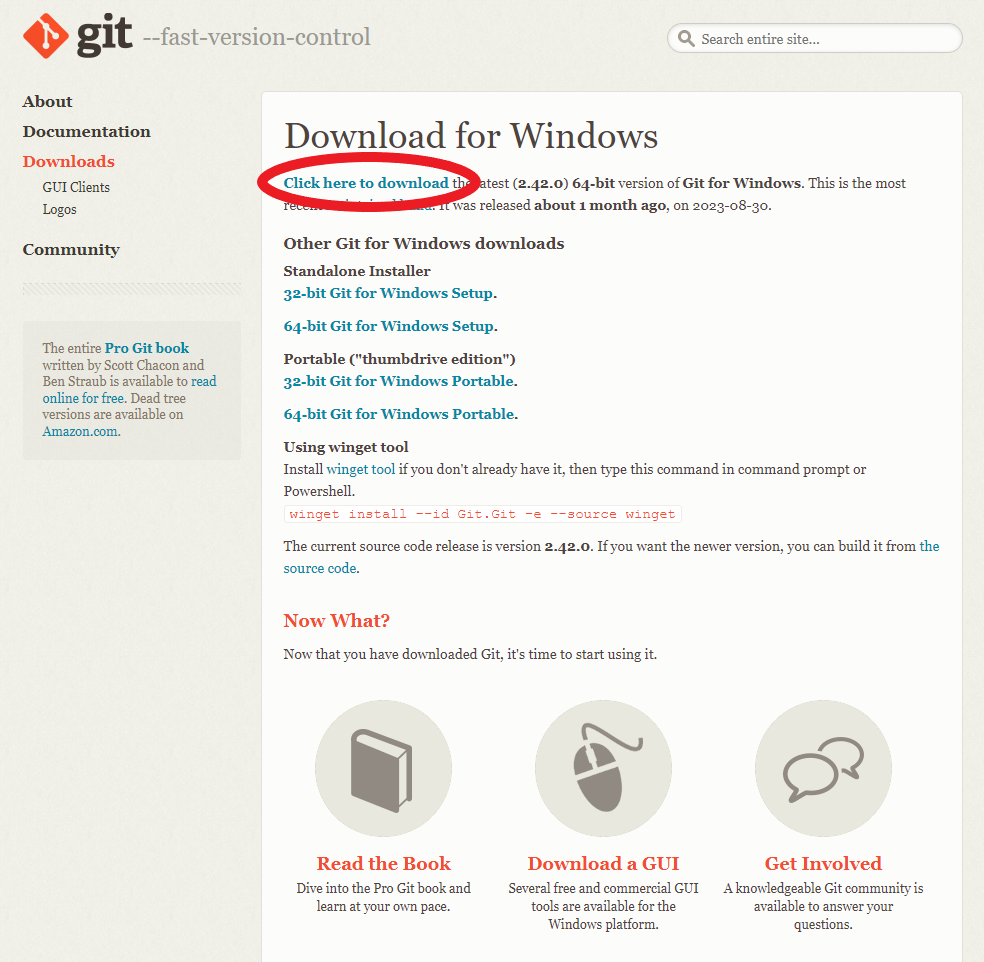
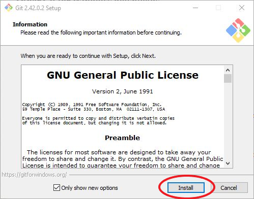
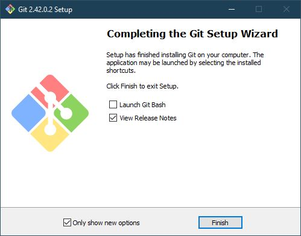
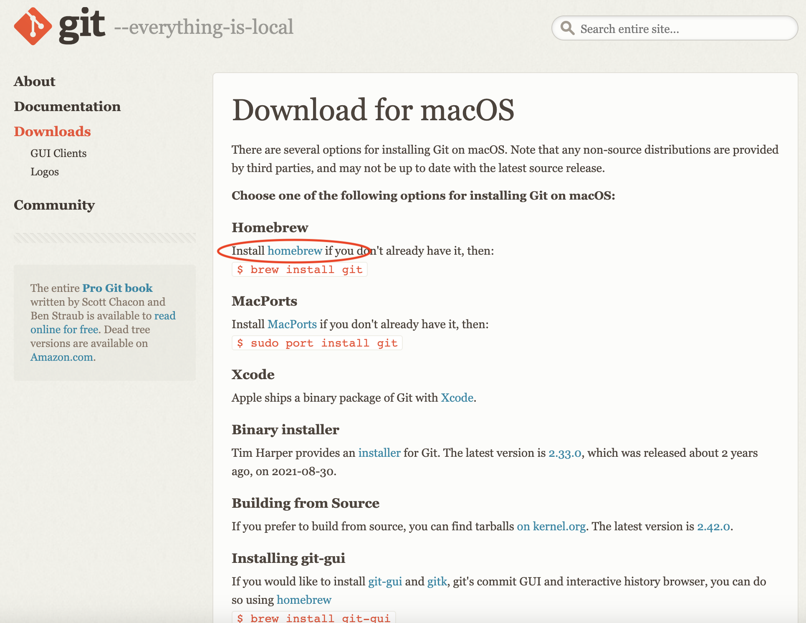
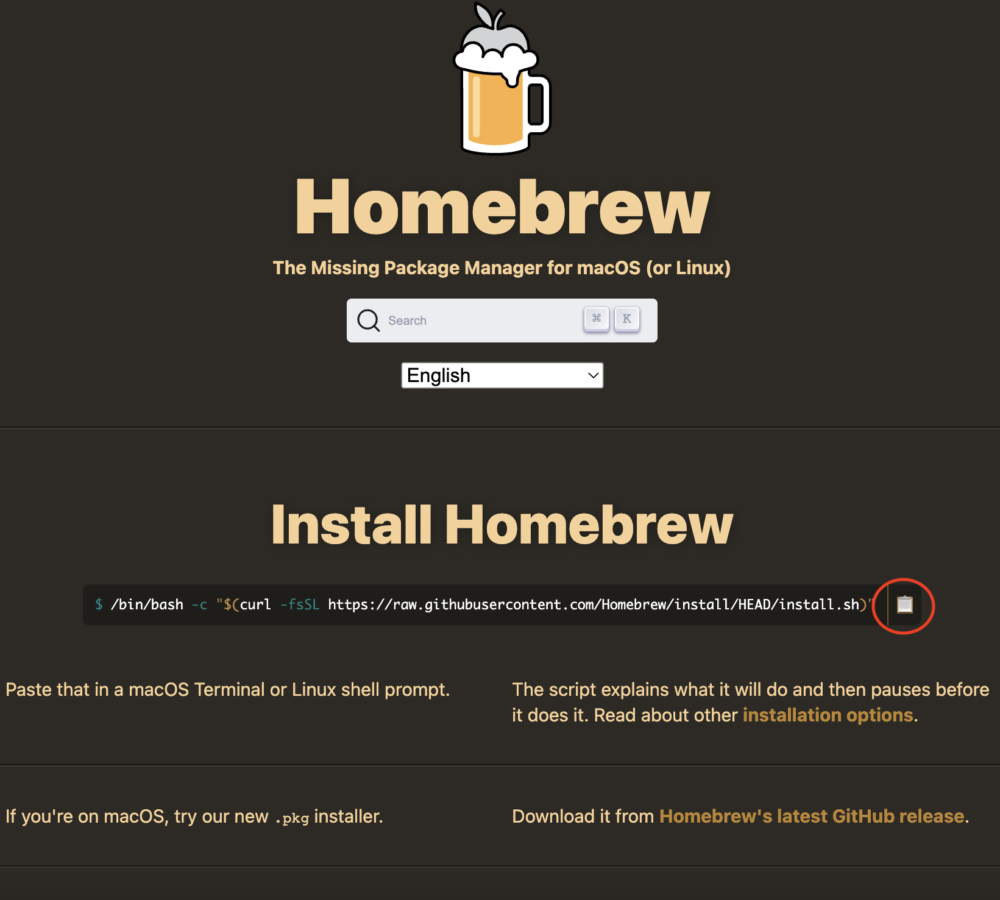

# How to Download Git?

One of my favorite things about Git is how easy it is to download and get set up onto your computer.

1. Go to https://git-scm.com/downloads
2. Select your operating system of choice

   

## Windows

3. Click the [Click here to download](https://git-scm.com/download/win#:~:text=Click%20here%20to%20download) button

   

4. A download of a .exe file will start. Open it when it finishes downloading. You will be prompted to allow it to make changes on your device, select yes.
5. Once the .exe is open, feel free to read through the GNU General Public License. Click install after you read it.

   

6. Once Git is finished downloading, click finish. You can unselect the release notes option if you do not care to see them. If you keep it selected, a webpage will open with the release notes.

   

## MacOS

3. Click the [homebrew](https://git-scm.com/download/mac#:~:text=Install-,homebrew,-if%20you%20don%27t) button

   

4. Copy the command from the homebrew page and execute it in a terminal. Expect there to be a lot going on, homebrew is an awesome package installer that installs the essential tools you need to be a developer.
   

5. Once homebrew has finished, execute the following command in the terminal:

   brew install git

## Linux

As there are many flavors of Linux, execute the associated command for your flavor.

Ex. For Fedora 22 and later, execute the following command in a terminal:

dnf install git
