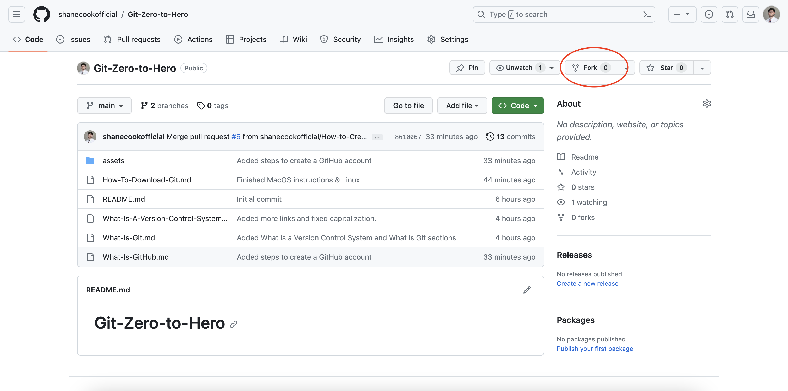
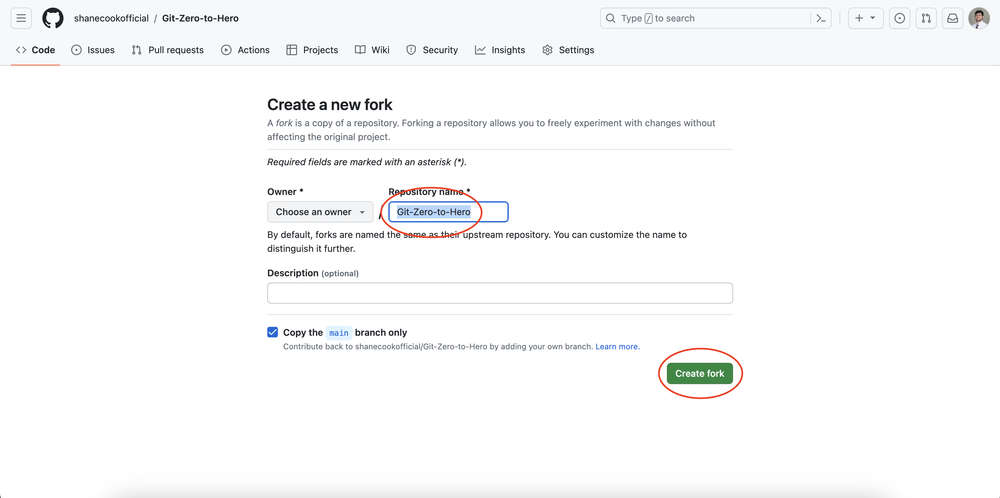
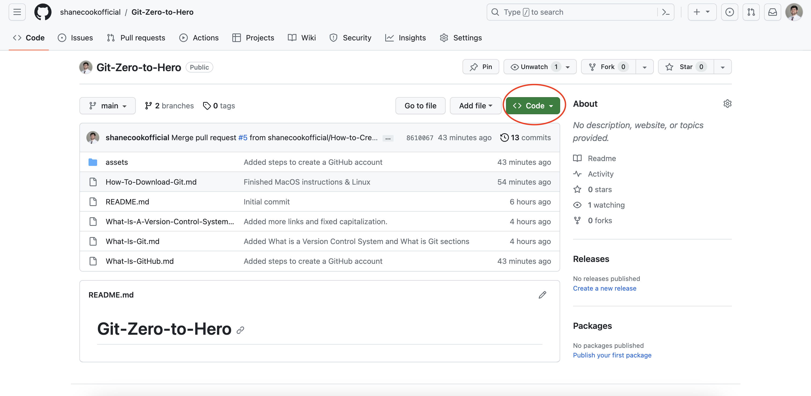
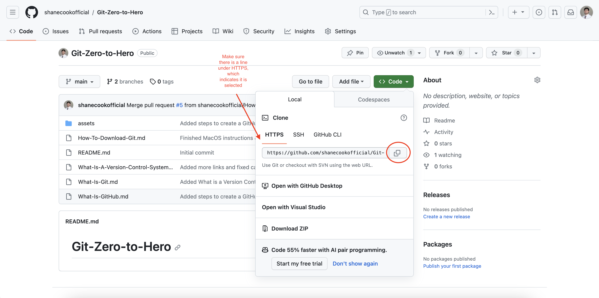
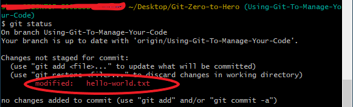
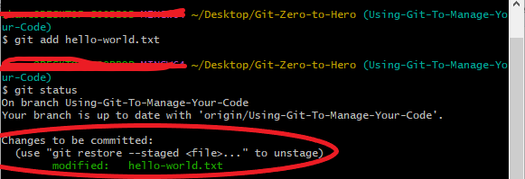
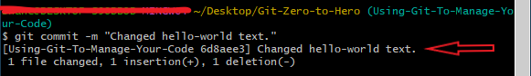
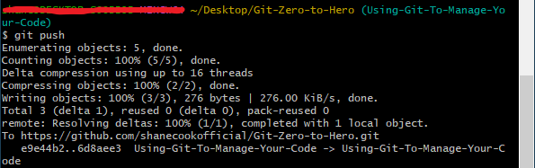

# Using Git to Manage Your Code

Imagine you and your team are collaborating on a software project to create a Tic-Tac-Toe game. Each member of the team is responsible for a specific aspect of the project. As changes and updates are required, everyone must manually copy and integrate the code onto their individual computers. This process can quickly become arduous and time-consuming when changes need to be passed back and forth through email or Google Drive. Moreover, there is the risk of unintentionally introducing bugs into the codebase. In such a scenario, it becomes difficult to pinpoint who made the changes and when they were implemented. Debugging becomes a daunting task, potentially leading to weeks of lost progress.

A problem like this could have easily been prevented with the use of a version control system like Git.

## Prerequisites

- An idea of what a version control system is
- An idea of what Git is
- Git downloaded on your computer
- An idea of what GitHub is
- A GitHub account

## What is a repository?

A repository essentially is a folder that contains files for a software project.

In the example above, a shared repository could have easily solved a lot of the problems for the group working on the Tic-Tac-Toe project. GitHub is a cloud service that allows for repositories to be stored in the cloud.

Many software teams use cloud services such as GitHub to work on software projects together. The main repository is stored in the cloud which allowws for teams to be able to work on the same codebase together. Each person will _clone_ the main repository to their own computer and work on whatever feature they are assigned.

We are going to practice this right now!

## Practice

1. Go to [this repository](https://github.com/shanecookofficial/Git-Zero-to-Hero).
2. Fork the repository by clicking the Fork button.

3. Change the name of the repository and make sure your username is selected as the owner. Click create fork when you are done. You have now created your a repository! A fork essentially is a copy of a repository.

4. Your screen should now have the name of your new repository instead of Git-Zero-to-Hero. If it does, click the green code button. A drop down should open below the button.

5. Make sure HTTPS has an underline indicating it has been selected. If you are working on a smaller screen, it might be darkened grey. Once you have verified it is selected, click the copy button.

6. Open up a terminal
   
   For Windows:

   - Press Win + R to open the Run dialog.
   - Type cmd and press Enter.

   For MacOS

   -  You can find Terminal in the Utilities folder within the Applications folder or use Spotlight or press Cmd + Space, then type "Terminal".

   For Linux:

   - Open a terminal emulator (e.g., GNOME Terminal, Konsole, xterm).

7. Make sure your current working directory is Desktop

   Enter the following command into your terminal:

   For Windows:

   - cd Desktop

   For MacOS and Linux:

   - cd ~/Desktop

8. Enter the following command:

   git clone -copied url-

   Make sure to replace -copied url- with the url you copied from GitHub.

   Whenever you want to execute a git command, always preface the command with 'git'. Just now, we executed the 'git clone' command which allows us to clone a repository from the internet. There are several ways you can go about this like through SSH but for the sake of this tutorial, we will be using HTTPS.

   Once you execute the command, you will be prompted to enter your github username and password. Do so. Do not close your terminal when you are done.

   Congradulations on executing a git command!

   If you open up a visual file explorer, you will see a new folder with the same name as your forked repository. This is because you have created a local instance of your repository that is stored in the cloud through GitHub. You can make changes to it and update the main repository in the cloud through more Git commands!

9. Open up the hello-world.txt file located in your local repo.

   You can do this either through the command line or through a visual file explorer. For the sake of simplicity, we will just open the file with a visual file explorer.

   Once the hello-world.txt file is opened, replace the text in it with 'Hello World!' and save the file.

10. Check the status of changes you have made.

      In your terminal, execute the following command:

         git status

      After you run the command, you should see a similar output on your terminal:

      

      git status is a command that shows you the current changes that are made on your local repository. It can be extremely helpful to manage your own personal progress when working on different projects.

11. Add your changes to be staged to commit to the main repository.

      You have made some changed, now it is time to stage them to get ready to merge them into the main branch.

      In your terminal, execute the following commands:

         git add hello-world.txt

         git status

      After you run the command, you should see a similar output on your terminal:

      

      git add is a command that shows you the current staged changes on your local repository. This command is vital to making sure specific changes are added and others are not.

12. Commit your changes.

      Now that you have staged your changes, it is time to commit them!

      In your terminal, execute the following command:

         git commit -m "Changed hello-world text."

      After you run the command, you should see a similar output on your terminal:

      

      Now there is a chance some of you may have messed up somewhere and are kind of freaking out. There is a fix for this!

      If you want to undo your commits, execute the following command in your terminal:

         git reset --soft HEAD^

      This command essentially allows you to keep your modified changes while undoing any commits.

      If you want to go back x amount of commits, execute the following command in your terminal:

         git reset --soft HEAD~x

      Make sure to replace x with the number of commits you want to revert back to.

      If you want to just reset everything back to normal, removing any and all changes, execute the following command in your terminal:

         git reset --hard HEAD^

      One last note, if you are on a Windows machine, you must put HEAD in quotes, for example:

         git reset --soft "HEAD^"

13. Push your changes!

      We are almost to the finish line! Once you are 100% all ready to go, execute the following command in your terminal:

         git push

      After you run the command, you should see a similar output on your terminal:

      

      Now, let's take a look at your github repository! You should now see new changes have been made and your main repository has been updated!

## Review

We did a lot in this lesson! To summarize:

- A repository is a folder that contains all of the files for a project.
- `git clone` allows you to _clone_ a repository from another source like GitHub for example.
- `git add` allows you to stage changes you make in a local repository.
- `git commit` allows you to commit changes. Don't forget to add `-m` and a comment in quotes after to summarize your commit.
- `git push` allows you to push your changes up to wherever the main repository is stored.