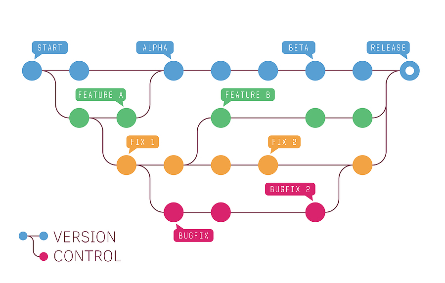

# What is a Version Control System (VCS)?

According to Atlassian, “[Version control, also known as source control, is the practice of tracking and managing changes to software code. Version control systems are software tools that help software teams manage changes to source code over time.](https://www.atlassian.com/git/tutorials/what-is-version-control#:~:text=Version%20control%2C%20also%20known%20as%20source%20control%2C%20is%20the%20practice%20of%20tracking%20and%20managing%20changes%20to%20software%20code.%20Version%20control%20systems%20are%20software%20tools%20that%20help%20software%20teams%20manage%20changes%20to%20source%20code%20over%20time.)”

Imagine you and your team are collaborating on a software project to create a Tic-Tac-Toe game. Each member of the team is responsible for a specific aspect of the project. As changes and updates are required, everyone must manually copy and integrate the code onto their individual computers. This process can quickly become arduous and time-consuming when changes need to be passed back and forth through email or Google Drive. Moreover, there is the risk of unintentionally introducing bugs into the codebase. In such a scenario, it becomes difficult to pinpoint who made the changes and when they were implemented. Debugging becomes a daunting task, potentially leading to weeks of lost progress.

This is precisely where a version control system proves invaluable. A version control system enables individuals to track the change history or "versions" of a project. Teams can employ cloud-based services like [GitHub](https://github.com/) to manage shared repositories and effortlessly share version history with one another. With this system in place, the chaos and uncertainty associated with manual code management are replaced by an organized and efficient collaborative process.

Popular version control systems include [Git](https://git-scm.com/), [Subversion (SVN)](https://subversion.apache.org/), [Mercurial](https://www.mercurial-scm.org/), [Perforce](https://www.perforce.com/solutions/version-control), and [Team Foundation Version Control (TFVC)](https://learn.microsoft.com/en-us/azure/devops/repos/tfvc/?view=azure-devops).