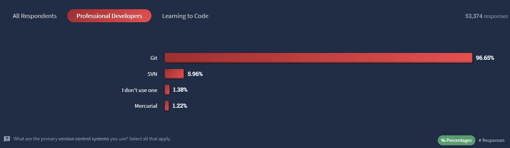

# What is Git?

According to the Git website, “[Git is a free and open source distributed version control system designed to handle everything from small to very large projects with speed and efficiency.](https://git-scm.com/#:~:text=Git%20is%20a%20free%20and%20open%20source%20distributed%20version%20control%20system%20designed%20to%20handle%20everything%20from%20small%20to%20very%20large%20projects%20with%20speed%20and%20efficiency.)”

Git is by far the most popular Version Control System used worldwide because it is easy to learn, has a very tiny footprint, has incredibly fast performance, and on top of all of that, it is free!

In 2022, Stack Overflow, "[a question-and-answer website for programmers](https://en.wikipedia.org/wiki/Stack_Overflow#:~:text=a%20question%2Dand%2Danswer%20website%20for%20programmers)", took a survey of over 70,000 developers. In the survey, the question of "[What are the primary version control systems you use?](https://survey.stackoverflow.co/2022/#version-control-version-control-system-prof:~:text=What%20are%20the%20primary%20version%20control%20systems%20you%20use%3F)" was asked, and the results were astonishing.

Amongst [53,374](https://survey.stackoverflow.co/2022/#version-control-version-control-system-prof:~:text=Learning%20to%20Code-,53%2C374,-responses) professional developers, over [96%](https://survey.stackoverflow.co/2022/#version-control-version-control-system-prof:~:text=Git-,96.65%25,-SVN) of them use Git. The next highest VCS being Apache's SVN at almost [6%](https://survey.stackoverflow.co/2022/#version-control-version-control-system-prof:~:text=SVN-,5.96%25,-I%20don%27t%20use).

Git's online book states, "[The major difference between Git and any other VCS (Subversion and friends included) is the way Git thinks about its data. Conceptually, most other systems store information as a list of file-based changes. These other systems (CVS, Subversion, Perforce, and so on) think of the information they store as a set of files and the changes made to each file over time (this is commonly described as delta-based version control).](https://git-scm.com/book/en/v2/Getting-Started-What-is-Git%3F#:~:text=The%20major%20difference,based%20version%20control)"

The book continues saying, "[Git doesn’t think of or store its data this way. Instead, Git thinks of its data more like a series of snapshots of a miniature filesystem. With Git, every time you commit, or save the state of your project, Git basically takes a picture of what all your files look like at that moment and stores a reference to that snapshot. To be efficient, if files have not changed, Git doesn’t store the file again, just a link to the previous identical file it has already stored. Git thinks about its data more like a stream of snapshots.](https://git-scm.com/book/en/v2/Getting-Started-What-is-Git%3F#:~:text=Git%20doesn%E2%80%99t%20think,of%20snapshots.)"

The book concludes by stating, "[This is an important distinction between Git and nearly all other VCSs. It makes Git reconsider almost every aspect of version control that most other systems copied from the previous generation. This makes Git more like a mini filesystem with some incredibly powerful tools built on top of it, rather than simply a VCS.](https://git-scm.com/book/en/v2/Getting-Started-What-is-Git%3F#:~:text=This%20is%20an%20important%20distinction,rather%20than%20simply%20a%20VCS.)"

In conclusion, Git stands out as a highly popular and efficient version control system, widely adopted by developers worldwide. The 2022 Stack Overflow survey revealed its dominant presence among professional developers, with over 96% of them preferring Git over other options. Git's uniqueness lies in its approach to data storage, which is centered around snapshots of a project's state over time rather than traditional file-based changes. This distinctive feature transforms Git into more than just a version control system; it becomes a miniature filesystem with robust version control capabilities, setting it apart from its predecessors and making it an indispensable tool for managing projects of all sizes.